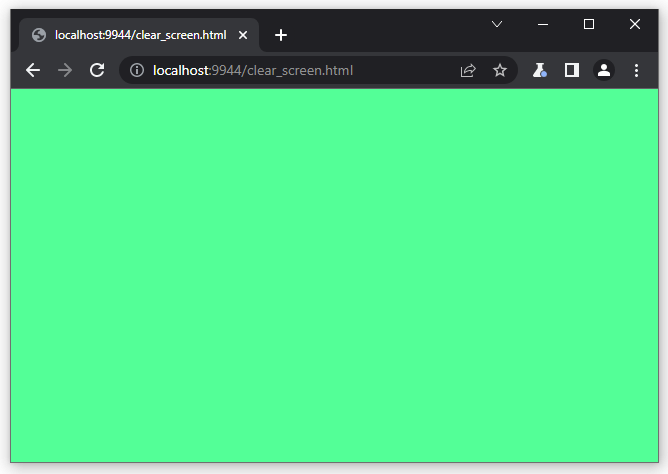
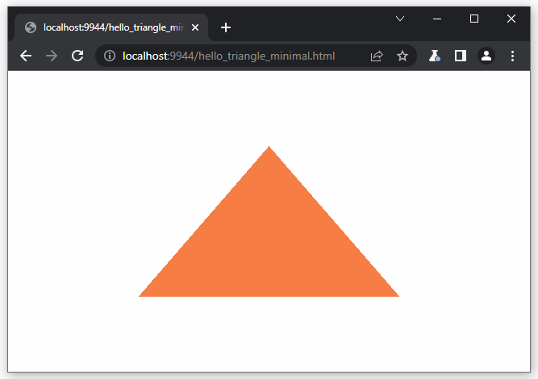
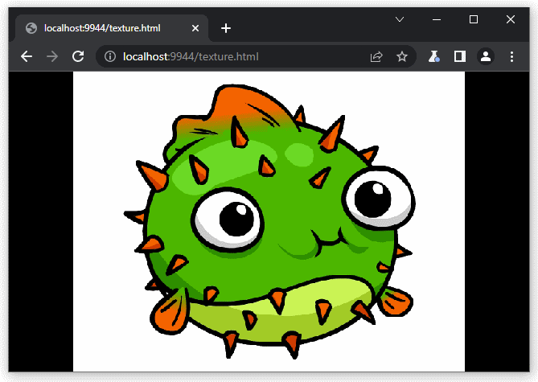

# WebGPU in Wasm via Emscripten (or Dawn)


This repository contains an Emscripten system library for utilizing WebGPU from a C/C++ codebase, along with a few small C code examples on how to use it.

To utilize the library in your own application, copy the contents of the `lib/` directory into your project:

 - [lib/lib_webgpu.h](lib/lib_webgpu.h)
 - [lib/lib_webgpu.js](lib/lib_webgpu.js)
 - [lib/lib_webgpu.cpp](lib/lib_webgpu.cpp)
 - [lib/lib_webgpu_fwd.h](lib/lib_webgpu_fwd.h)
 - [lib/lib_webgpu_cpp20.cpp](lib/lib_webgpu_cpp20.cpp) or [lib/lib_webgpu_cpp11.cpp](lib/lib_webgpu_cpp11.cpp), depending on if your compiler has C++20 or C++11.

Additionally, if you are using Closure Compiler, also copy the Closure externs file into your project:

 - [lib/webgpu-closure-externs.js](lib/webgpu-closure-externs.js)

 and specify the Emscripten linker argument `--closure-args=--externs=/path/to/webgpu-closure-externs.js` when linking your project.


Then `#include "lib_webgpu.h"` to access the API, compile in `lib_webpgu.cpp` and `lib_webgpu_cpp20.cpp` with the rest of your project files, and finally link with `--js-library /absolute/path/to/lib_webgpu.js` on the Emscripten command line to include the code. See the provided [CMakeLists.txt](samples/CMakeLists.txt) for example usage.

For your convenience, a forward declaration header is also provided, and can be included with `#include "lib_webgpu_fwd.h"`.

# Using WebGPU via Dawn

It is also possible to target WebGPU outside the browser via Dawn. When doing so, also compile the dawn-specific file with your project:

 - [lib/lib_webgpu_dawn.cpp](lib/lib_webgpu_dawn.cpp)

TODO: add more instructions about targeting Dawn natively.

## 🗓 Implementation Status

The repository was last updated to match the API IDL of the WebGPU specification as of 🗓 **6th of September 2024**.

## 🏃‍ Quick Getting Started

If you want to get to building WebGPU content quickly, try the following:

1. As a prerequisite, download Emscripten if you don't have it already:
```
> git clone https://github.com/emscripten-core/emsdk
> cd emsdk
> emsdk install latest ninja-git-release-64bit
> emsdk activate latest ninja-git-release-64bit
> source ./emsdk_env.sh     # This line only on Linux and macOS. Not needed on Windows
```

2. In the same command prompt, clone and build wasm_webgpu samples:

```
> git clone https://github.com/juj/wasm_webgpu
> cd wasm_webgpu
> mkdir build
> cd build
> emcmake cmake -G Ninja ../samples
> ninja
```

3. Launch the `emrun` ad hoc web server to host the built .html pages:

```
> emrun .
```

An ad hoc web server index will pop up, allowing you to launch the different sample programs in this repository.

## Features and Design

This bindings library is developed with the following:

### 📐 1:1 API mapping with JS

For the most parts, the JavaScript side WebGPU API is directly mapped 1:1 over to WebAssembly side to enable developers to write WebGPU code in C/C++ by using the official [specification IDL](https://www.w3.org/TR/webgpu/) as reference.

Type names and structs follow a naming convention `WGpu*`, mapped from JS names by transforming `GPUAdapter` -> `WGpuAdapter`. API function names use a prefix `wgpu_*`, and are mapped using the convention `GPUCanvasContext.configure(...)` -> `wgpu_canvas_context_configure(canvasContext, ...)`. Enums and #defines use a prefix `WGPU_`, e.g. `GPUPowerPreference` -> `WGPU_POWER_PREFERENCE`.

A few exceptions to this are done in the name of accommodating better Wasm<->JS language marshalling, noted where present in the `lib_webgpu.h` header.

### 🚀 Best performance and Minimal code size

The primary design goal of the library is to provide absolutely best runtime speed and minimal generated code size overhead, carefully shaving down every individual byte possible. The intent is to enable using this library in extremely code size constrained deployment scenarios.

The library is implemented very C-like, void of high-level JavaScript abstractions, and manually tuned to produce smallest code possible. This has been observed to work best to provide the thinnest JS<->Wasm language marshalling layer that does not get in the way.

### 🗑 Mindful about JS garbage generation

Another design goal is to minimize the amount of JS temporary garbage that is generated. Unlike WebGL, WebGPU API is unfortunately quite trashy, and it is not possible to operate WebGPU without generating some runaway garbage each rendered frame. However, the binding layer itself minimizes the amount of generated garbage as much as possible.

If there is a tradeoff between generated garbage, code size, or runtime speed, build flags are provided to favor one over the other. (currently there aren't any, but this is expected to change)

### 📜 Custom API for marshalling buffer data

Some WebGPU features do not interop well between JS and Wasm if translated 1:1. Buffer mapping is one of these features. To help JS<->Wasm interop, this library provides custom functions `wgpu_buffer_read_mapped_range()` and `wgpu_buffer_write_mapped_range()` that do not exist in the official WebGPU specification.

For an example of how this works in practice, see the sample [vertex_buffer/vertex_buffer.c](samples/vertex_buffer/vertex_buffer.c)

### 🔌 Extensions for binding with other JS APIs

To enable easy uploading of image URLs to WebGPU textures, an extension function `wgpu_load_image_bitmap_from_url_async()` is provided. For an example of this, see the sample [texture/texture.c](samples/texture/texture.c)

### 🚦 JSPI support

When building with Emscripten linker flag `-sJSPI` (requires Emscripten 3.1.59 or newer), the following extra functions are available:

- `navigator_gpu_request_adapter_sync` and `navigator_gpu_request_adapter_sync_simple`: Synchronously request a GPUAdapter.
- `wgpu_adapter_request_device_sync` and `wgpu_adapter_request_device_sync_simple`: Synchronously request a GPUDevice.
- `wgpu_buffer_map_sync`: Synchronously map a GPUBuffer.
- `wgpu_present_all_rendering_and_wait_for_next_animation_frame`: Presents current rendered frame, runs browser event loop, and waits until next animation frame. See the sample [clear_screen/clear_screen_sync.c](samples/clear_screen/clear_screen_sync.c) for an example.

These functions enable a synchronous variant of the `_async` functions offered in the WebGPU specification. These can be useful for prototyping and test suites etc., though note that there are some concerns over the runtime performance of JSPI, so be very mindful about profiling the impact on performance when using JSPI.

Additionally, note that the web browser will keep pumping web events while WebAssembly execution is suspended via JSPI. Therefore you may see your web event callbacks being fired at odd times. This can break ordering and re-entrancy semantics of your expected code execution. To remedy this problem, you can try guarding/queueing your event callbacks whenever a JSPI suspend is currently in effect. See the function `wgpu_sync_operations_pending()` for this.

### 🧶 OffscreenCanvas support

It is possible to perform WebGPU rendering from a dedicated background Worker thread using the Emscripten Wasm Worker, pthreads or proxy-to-pthread abstractions.

The following API functions are provided to manage OffscreenCanvas rendering:

```h
void offscreen_canvas_create(OffscreenCanvasId id, int width, int height);
void canvas_transfer_control_to_offscreen(const char *canvasSelector NOTNULL, OffscreenCanvasId id);
void offscreen_canvas_post_to_worker(OffscreenCanvasId id, emscripten_wasm_worker_t worker);
void offscreen_canvas_post_to_pthread(OffscreenCanvasId id, pthread_t pthread);
WGPU_BOOL offscreen_canvas_is_valid(OffscreenCanvasId id);
void offscreen_canvas_destroy(OffscreenCanvasId id);
int offscreen_canvas_width(OffscreenCanvasId id);
int offscreen_canvas_height(OffscreenCanvasId id);
void offscreen_canvas_size(OffscreenCanvasId id, int *outWidth NOTNULL, int *outHeight NOTNULL);
void offscreen_canvas_set_size(OffscreenCanvasId id, int width, int height);
```

See [lib_webgpu.h](lib/lib_webgpu.h) header file for detailed documentation, and the samples/offscreen_canvas/ subdirectory for code snippets.

When targeting OffscreenCanvas with Wasm Workers, pass the Emscripten compiler flag `-sWASM_WORKERS` for each compilation unit, and the linker flags `-sWASM_WORKERS -sENVIRONMENT=web,worker` for the final link.

When targeting OffscreenCanvas with pthreads, pass the Emscripten compiler flag `-pthread` for each compilation unit, and the linker flags `-pthread -sENVIRONMENT=web,worker` for the final link.

Finally, when targeting OffscreenCanvas with the proxy-to-pthread option, pass the Emscripten compiler flag `-pthread` for each compilation unit, and the linker flags `-pthread -sENVIRONMENT=web,worker -sOFFSCREENCANVAS_SUPPORT -sOFFSCREENCANVASES_TO_PTHREAD=#canvas -lGL -sPROXY_TO_PTHREAD` for the final link. Note that the linkage to the WebGL support library is needed here for historical reasons. This might change in the future.

### 🖥 2GB + 4GB + Wasm64 support

Wasm_Webgpu supports each of the three main memory models that Emscripten supports:

- 2GB mode: link with `-sMAXIMUM_MEMORY=2GB` or less,
- 4GB mode: link with `-sMAXIMUM_MEMORY=4GB` or less,
- Wasm64 mode: link with `-sMEMORY64=1 -sMAXIMUM_MEMORY=16GB` or some other value > 4GB.

When building code samples, pass `-DMEMORY64=1` to CMake to test compiling in Wasm64 build mode.

## 🚥 Requirements

Wasm_Webgpu requires Emscripten 3.1.35 or newer.

## 🔬 API Unit Tests

Run `test.py --browser="C:\Users\clb\AppData\Local\Google\Chrome SxS\Application\chrome.exe" <test1> <test2> ... <testN>` to run unit tests.

Replace the cmdline to `--browser=` with location of your own WebGPU supporting browser, or omit to run in system default browser.

In `<testN>` you can pass names of tests to run. Test names are substring matches to filter filenames inside [test/](test/) subdirectory, so for example `test.py adapter device` would run all tests with substring `adapter` or `device` in it. Do not specify any test names to run through all tests in the suite.

To add a new test in the suite, create a new .cpp file with the test contents in the [test/](test/) subdirectory, and run `test.py name_of_cpp_file` to run the test.

## 🧪 Samples

Several test cases are available under the `samples/` subdirectory.

Don't expect flashy demos. The test cases exercise features relevant to data marshalling between WebAssembly and JavaScript languages, and are not intended to showcase fancy graphical effects.

To build the samples, first install Emscripten via [Emsdk](https://github.com/emscripten-core/emsdk), then enter Emsdk command line environment (`emsdk_env`), and type

```bash
cd path/to/wasm_webgpu
mkdir build
cd build
emcmake cmake ../samples -DCMAKE_BUILD_TYPE=Debug # Or MinSizeRel, RelWithDebInfo or Release
make -j
```

On Windows, the last `make` command is not available, so either install Mingw32-make via emsdk and run `mingw32-make -j`, or install Ninja via emsdk, then pass `-G Ninja` to the emcmake command line, and then run `ninja` instead of `make`.

### clear_screen



For the smallest Clear Screen "hello world" example, see [clear_screen.c/clear_screen.c](samples/clear_screen/clear_screen.c).

There is also an Emscripten JSPI-enabled variant of the same demo, at [clear_screen.c/clear_screen_sync.c](samples/clear_screen/clear_screen.c).

### failing_shader_compilation

The demo [failing_shader_compilation/failing_shader_compilation.c](samples/failing_shader_compilation/failing_shader_compilation.c) tests handling of shader compilation errors.

### gpu_oom

The demo [gpu_oom/gpu_oom.c](samples/gpu_oom/gpu_oom.c) exhausts the GPU VRAM, testing handling of GPU OOM events.

### hello_triangle



The demo [hello_triangle/hello_triangle_minimal.c](samples/hello_triangle/hello_triangle_minimal.c) contains the smallest triangle rendering demo.

The variant [hello_triangle/hello_triangle_verbose.c](samples/hello_triangle/hello_triangle_verbose.c) offers the same, but with verbose debug logging.

### offscreen_canvas

The demo [offscreen_canvas/offscreen_canvas.c](samples/offscreen_canvas/offscreen_canvas.c) shows how to perform WebGPU rendering using OffscreenCanvas from a Wasm Worker.

If you are using pthreads, the variant [offscreen_canvas/offscreen_canvas_pthread.c](samples/offscreen_canvas/offscreen_canvas_pthread.c) illustrates OffscreenCanvas rendering by using a pthread instead.

Finally, if you are using pthreads with the Emscripten `-sPROXY_TO_PTHREAD` build option, then check out the [offscreen_canvas/offscreen_canvas_proxy_to_pthread.c](samples/offscreen_canvas/offscreen_canvas_proxy_to_pthread.c) code sample.

### texture



The sample [texture/texture.c](samples/texture/texture.c) tests the `wgpu_load_image_bitmap_from_url_async()` API.

### vertex_buffer


The test [vertex_buffer/vertex_buffer.c](samples/vertex_buffer/vertex_buffer.c) shows an example of how to map a GPU buffer and use the function `wgpu_buffer_write_mapped_range()`.
